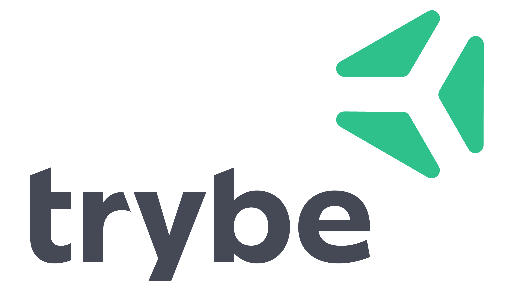

# Empresas
Lista de empresas usando Elixir no Brasil, para adicionar a sua basta enviar um `Pull Request`.

## Lista de Empresas

* [Xerpa (São Paulo/SP)](https://xerpa.com.br)
* [Umanni (São Paulo/SP)](http://umanni.com.br/)
* [Globosat (Rio de Janeiro/RJ)](http://canaisglobosat.globo.com/)
* [Podium (São Paulo/SP)](https://github.com/elixirbrasil/empresas#podium)
* [Trybe (Belo Horizonte/MG e São Paulo/SP)](https://www.betrybe.com/)
* [Empresa de exemplo (Cidade/UF)](https://github.com/elixirbrasil/empresas#empresa-de-exemplo)

_______

### Xerpa (São Paulo/SP) 

A Xerpa construiu todo o backend usando Elixir, entrando em produção em
outubro/2015.

A Xerpa é construida "100%" em linguagens funcionais (Elixir, Clojure e um teco
de Haskell), e temos um time já com uma boa experiência nesse meio. Quando
iniciamos o projeto, Elixir era novidade para todos do time. Foi surpreendente a
velocidade com que ficamos "confortáveis" com a linguagem. *Everything feels right*

Dito isso, estamos extremamente satisfeitos com o design da linguagem, com a
performance do framework Phoenix e com a produtividade e "felicidade" oferecidos
por ambos.

_____

### Umanni (São Paulo/SP)

**[Umanni](http://umanni.com.br/)**

Somos uma empresa que tem um produto de HCM construído em Ruby On Rails.

Depois de muito estudar como resolver problemas de escalabilidade que poderiam se tornar problemáticos em futuro próximo, e de fazer alguns experimentos em mockups de migração para outras linguagens/frameworks tais como Scala/Playframework, Clojure e mesmo Go, optamos por Elixir/Phoenix por trazer o melhor balanço entre agilidade e ergonomia durante o processo de desenvolvimento de novas features, facilidade de manutenção de código em produção, algo que já tínhamos no RoR, sem comprometer a performance da aplicação.

Como já trabalhavamos com idiomas funcionais sempre que possível no Ruby e ainda mais no JS, para nós tem sido uma experiência maravilhosa trabalhar com Elixir. Esperamos ter em breve a versão 100% Elixir/Phoenix em produção.

______

### Globosat (Rio de Janeiro/RJ) 

**[Globosat](http://google.com/)**

Fundada em 1991, somos hoje a maior programadora de TV por assinatura da América Latina e estamos presente no cotidiano de mais de 56 milhões de pessoas em todo Brasil.

Temos no portfólio 33 canais, sendo: 18 com transmissão também em HD (alta definição), 9 em PPV (pay-per-view), 1 internacional para os aficionados em futebol que moram no exterior, além de 5 serviços de conteúdo sob demanda.

Na Globosat cada programa é cuidadosamente criado para atender as diversas áreas de interesse dos assinantes, que formam um público crítico, exigente, altamente qualificado e formador de opinião. Um consumidor cada vez mais ávido e interessado que quer ver retratada a sua identidade cultural.

Começamos com Elixir em Dez/2016, usando `Phoenix Channels` para fornecer o conteúdo do aplicativo CombatePlay em tempo real.

______

### Podium (São Paulo/SP)

**[Podium](https://www.podium.com/)**

Podium is an Interaction Management™ platform that enables 30,000+ businesses with a local presence to communicate more effectively with their customers. Podium is the largest, fastest-growing Elixir shop in the world, and we have run Elixir code in production since 2016. As one of Y Combinator's highest-valued companies, we've received investment from Google Ventures, Accel, and other firms. We're constantly looking for passionate Elixir developers to help us change the way business happens locally. Visit our [engineering blog](https://medium.com/podium-engineering) and [Twitter](https://twitter.com/podium_eng?utm_source=elixirbrasilgithub) for more.

______

### Trybe (Belo Horizonte/BH e São Paulo/SP) 

**[Trybe](https://www.betrybe.com/)**

A Trybe é uma escola do futuro que foi fundada com o propósito de gerar oportunidades significativas para qualquer pessoa que queira melhorar de vida e construir uma carreira de sucesso em tecnologia.

Assumindo um compromisso genuíno com as pessoas, na Trybe elas só começam a pagar quando conseguirem um bom trabalho.

Para garantir esse sucesso, investimos em nossos estudantes com as melhores práticas de ensino online e offline, aliando metodologia baseada em projetos, vivência completa do ambiente de trabalho e currículo desenhado em parceria com os melhores profissionais de tecnologia do mundo e as empresas mais queridas para se trabalhar. Além disso, trabalhamos ativamente desde o início do programa para preparará-los e conectá-los com nossas empresas parceiras.

Na Trybe usamos Elixir contruindo a plataforma de estudo dos nossos estudantes.

______

### Empresa de exemplo (Cidade/UF)

**[Nome da Empresa](http://google.com/)**

Nós da Empresa de Exemplo usamos Elixir por ser uma linguagem excelente e desde que começamos a usar já nos economizou `2 bilhões` de reais por mês só em conta de energia.
